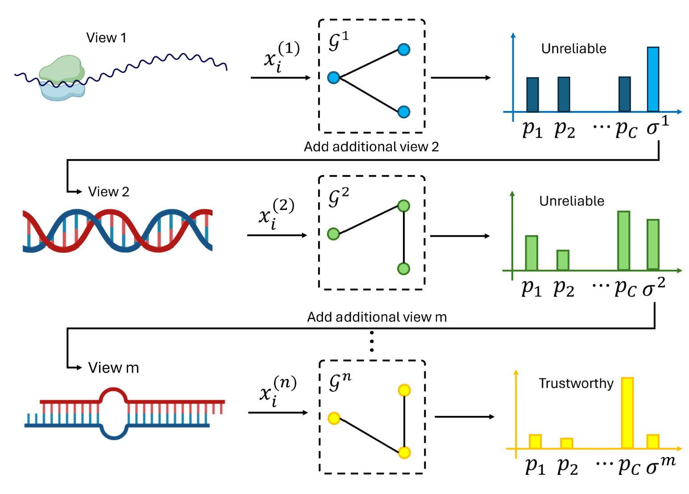

# Staged Multi-View Data Classification Using Uncertainty Quantification

2025 IEEE 37th International Conference on Tools with Artificial Intelligence (ICTAI)

Year: 2025, Pages: 700-704

DOI Bookmark: 10.1109/ICTAI66417.2025.00100

Authors

Yue Kang, Kennesaw State University,Department of Mathematics,Kennesaw,GA,30144  

Chen Zhao, Kennesaw State University,Department of Computer Science,Marietta,GA,30060

# Abstract
With the growing availability of multiview data, such as imaging, text, and clinical records, there is a strong potential to gain a more comprehensive understanding of multiview data and improve classification accuracy. However, traditional machine learning methods often require the simultaneous integration of all available data views, which may lead to inefficiencies, increased costs, and redundant testing. To address these challenges, we propose a novel Staged Multi-view Data Classification method using Uncertainty Quantification (SMUQ) method, designed for flexible and cost-effective multiview data classification. Instead of relying on all views from the outset, SMUQ begins with the most informative and accessible data modality (e.g., imaging) and selectively incorporates additional views-such as text data-only when necessary. This staged approach allows for personalized classification pathways, reducing unnecessary data acquisition while preserving high predictive performance. By modeling data uncertainty and inter-view relationships through graph structures, SMUQ dynamically adapts to each sample's available data, making it especially suitable for real-world multiview data classification settings where data completeness and quality can vary. SMUQ provides a generalizable framework for multiview data classification across a wide range of multiview data analysis related applications, supporting more efficient, interpretable, and scalable AI-driven decision-making.

## Step 1: generate training commands

See block 4 in summarize.ipynb

## Step 2: train models using the generated commands

## Step 3: Uncertainty quantification

See # set thresh in summarize.ipynb

## Step 4: visualize uncertainty

See Visualize uncertainty distribution in summarize.ipynb
